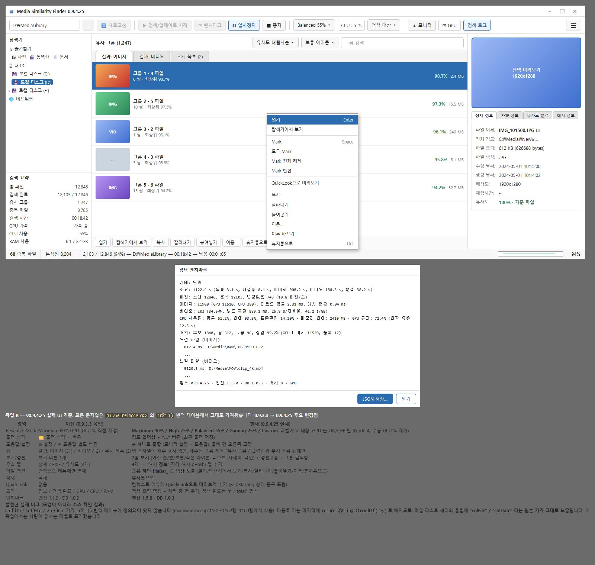

# MediaSimilarityFinder

Windows x64 media duplicate and visual-similarity search application.

MediaSimilarityFinder is designed as a **CPU + GPU cooperative application**. CPU remains the stable reference/fallback path; GPU accelerates suitable workloads automatically.

## UI Mockup

The Windows UI currently under development is designed around a **file-explorer-oriented interface similar to Windows Explorer**.

- Left: folder navigation and search summary
- Center: similar file/group list with sorting and view options
- Right: selected file preview and detailed information
- Bottom: search progress and processing status
- File management: open, show in Explorer, copy, cut, paste, move, recycle
- Search resources: CPU resource mode and GPU automatic acceleration status

### Current UI Mockup

[View the original UI mockup HTML](uimock/mockup-B-ko-list.html)

> The mockup is a design reference for explaining the current UI structure and functional direction. The final UI may be adjusted during development based on actual usability and performance validation.

## Resource Management

The following resource modes are provided to users.

- Maximum
- High
- Balanced
- Gaming
- Manual

CPU resource policy is user-selectable, while GPU utilization is not directly specified by the user.

- GPU ON → Adaptive GPU Scheduler automatically determines the GPU workload
- GPU OFF → CPU path
- CPU/GPU workload distribution is dynamic rather than fixed at 50:50, based on actual processing capability, real-time load, queue state, and data-transfer cost
- Initial hardware performance profiles are stored in INI and reused as starting values for subsequent searches
- CPU/GPU load caused by other applications is reflected in real time when adjusting workload
- Low-end iGPU/dGPU systems may automatically switch toward CPU-heavy or CPU-only execution

## Multi-vendor GPU Direction

The current GPU compute reference implementation is **NVIDIA CUDA**.

However, the upper-level architecture does not use CUDA as the generic name for the GPU system.

The target backend hierarchy includes NVIDIA CUDA, NVIDIA NVDEC, Vulkan, AMD HIP/ROCm, and Intel Level Zero. Intel/AMD iGPUs and dGPUs are designed to connect through the same GPU abstraction.

Vulkan is a vendor-neutral GPU compute candidate, while Intel Level Zero and AMD HIP/ROCm are optional vendor-specific backend candidates. Actual support and performance are determined by device/driver/backend capabilities and real workload measurements.

## Development Documentation Model

The actual workflow of the 0.9.4 development line is managed according to the A→B→C Development Roadmap rather than version numbers.

- Development Roadmap: `src_unpacked/docs/development-roadmap.en.md`
- Development Progress: `src_unpacked/docs/development-progress.en.md`
- Build History: `src_unpacked/docs/build-history/`

Roadmap nodes are not version numbers. Versions advance according to actual progress when validated code states are established.

## Detailed Architecture

- [CPU/GPU Adaptive Resource Scheduling](src_unpacked/docs/architecture/resource-scheduling.en.md)
- [GPU Backend and Build Naming Roadmap](src_unpacked/docs/architecture/gpu-backend-roadmap.en.md)
- [Benchmark and Runtime Telemetry Roadmap](src_unpacked/docs/architecture/benchmark-telemetry-roadmap.en.md)
- [Source Structure](src_unpacked/docs/STRUCTURE.md)
- [Build History](src_unpacked/docs/build-history/)

## Build Naming

Top-level build entry points use CPU/GPU terminology.

- CPU build: build-windows-cpu
- GPU build: build-windows-gpu

The existing 0.9.3.19 build-windows-cuda tree is preserved during the transition, while the new 0.9.4.x GPU build tree is created with a clean configure.

The actual NVIDIA implementation continues to use the CUDA technology name. In other words, **upper layers use GPU terminology, while lower-level implementations use the actual backend name**.

## Baseline

The official preserved GPU baseline is 0.9.2.32 and must not be modified or overwritten.

The CPU fallback is always maintained.
